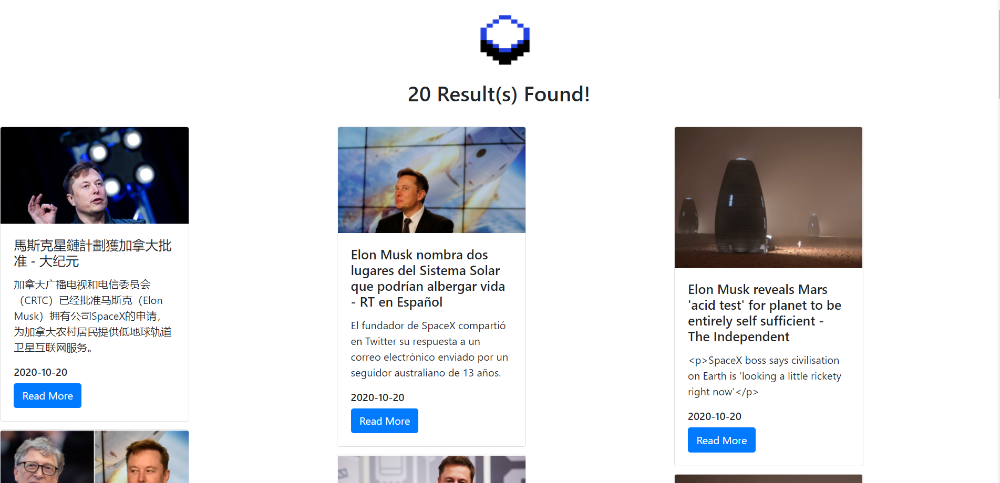

# ScopeStack: The News Search Engine

  

## Description

  

ScopeStack is a simple search engine for headlines from all around the world.
Users have the ability to search for headlines from three categories: Entertainment, Technology, and Sports

  

After searching for an article by using a search term and a category filter, you can browse headlines and
access the full articles using the links.

## Technologies Used
Flask (Python), Heroku (Deployment), HTML, CSS, JavaScript, and the NewsAPI: https://newsapi.org/

## Link to Web Page
Due to the discontinuation of the Heroku Free Tier, ScopeStack (formerly AkliNews) is currently unavailable.
ScopeStack will be relaunched (TBD)

*This application was developed for the Capital One Software Engineering Summit Interview*
